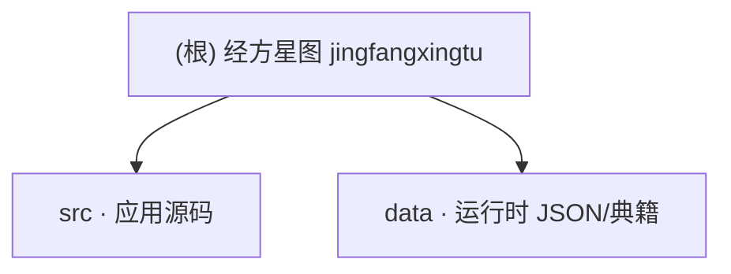

# 经方星图 (JingFang Graph) — AI 上下文

## 变更记录 (Changelog)

| 日期 | 说明 |
|------|------|
| 2026-04-21 09:40:04 | 增量重初始化（结构变更后复扫）：确认模块边界仅 `src/` 与 `data/`，`public/` 已移除，`/data/*` 继续映射仓库根 `data/` 并在构建后复制到 `dist/data/`。 |
| 2026-04-21 | 初始化根级与模块 `CLAUDE.md`、`.claude/index.json`。 |

---

## 项目愿景

**经方关系图** 将《伤寒论》等经典条文可视化为**关键词驱动的关系图**：条文维护原文、白话与关键词，系统再到 `data/关联解析/` 中按同名关键词检索命中内容，生成“条文 -> 关键词 -> 关联文献片段”的关系。应用为 **React 19 + Vite 6 + TypeScript + Tailwind 4**，关系图渲染使用 **D3**。依赖中包含 **`@google/genai`**，可在后续接入 **Gemini** 等能力（当前源码中未见调用，属可选扩展）。

---

## 架构总览

- **启动**：`src/main.tsx` 挂载 `App`；样式 `src/index.css`（Tailwind）。
- **配置与数据**：运行时通过 **`fetch('/data/...')`** 加载 JSON/TXT；物理文件位于**仓库根目录 `data/`**（开发由 Vite 中间件映射，构建产物在 **`dist/data/`**）。核心书目树与条文占位：`/data/jingdianconfig.json`；关联检索：`/data/guanlianjiexiconfig.json` 及 `关联解析/` 下各典籍的 `.json`/`.txt`。
- **源码数据**：前端运行时不再依赖源码内置条文数据；条文、目录与关联解析均从仓库根 `data/` 读取。
- **UI 布局**：左侧 `Sidebar`（书目、条文、搜索）；中部上 `GraphView`（D3 力导向关系图）、下 `ClauseDetail`；右侧 `PluginPanel`（关键词命中的关联结果折叠展示）；搜索由 `lib/searchUtils` 在预取的典籍文本/JSON 上执行。
- **环境**：`vite.config.ts` 将 `GEMINI_API_KEY` 注入 `process.env.GEMINI_API_KEY`；本地可复制 `.env.example` 为 `.env` / `.env.local`。**开发端口**：`package.json` 中 `dev` 为 **`3000`**。

---

## 模块结构图（Mermaid）

下列节点可点击，跳转到对应模块说明文档。

---

## 模块索引

| 模块 | 路径 | 职责摘要 |
|------|------|----------|
| 应用源码 | [src/](./src/CLAUDE.md) | React 页面、D3 关系图、搜索与面板逻辑 |
| 运行时数据 | [data/](./data/CLAUDE.md) | `fetch('/data/...')` 对应的 JSON/TXT、数据规范 [README](./data/README.md) |

---

## 运行与开发

| 命令 | 说明 |
|------|------|
| `npm install` | 安装依赖 |
| `npm run dev` | Vite 开发服务器，**端口 3000**，`--host=0.0.0.0` |
| `npm run build` / `npm run preview` | 生产构建与预览（`data/` 会复制到 `dist/data/`） |
| `npm run lint` | `tsc --noEmit` 类型检查 |

**环境变量**：`GEMINI_API_KEY`（见 `.env.example`）；`DISABLE_HMR=true` 时可关闭 HMR（注释说明用于 AI Studio 等场景）。

---

## 测试策略

当前 **`package.json` 无单元测试或 E2E 脚本**；质量门禁主要为 `npm run lint`（TypeScript）。新增逻辑时建议补 Vitest/Testing Library 等（待项目引入）。

---

## 全局约定

- **数据根目录**：运行时数据根固定为仓库 `data/`；`public/` 已移除，不再维护 `public/data`。
- **URL 契约**：前端继续以 `fetch('/data/*')` 访问数据；开发期由 `vite.config.ts` 中间件映射到仓库 `data/`，构建后复制到 `dist/data/`。
- **路径别名**：`@` 指向仓库根（见 `vite.config.ts`）。
- **关系模型**：条文 JSON 维护 `content` / `translation` / `keywords`；关系节点在运行时生成，分为 `clause` / `keyword` / `source`。
- **数据契约**：大规模条文以 JSON 驱动；`data/README.md` 为当前仓库的数据结构说明入口。

---

## AI 使用指引

- 改 UI/关系图：优先看 `src/App.tsx`、`GraphView.tsx`、`PluginPanel.tsx`。
- 改加载的数据：编辑 **`data/`**；核心入口是 `jingdianconfig.json`、`经典/`、`guanlianjiexiconfig.json` 与 `关联解析/`；勿忘 **`vite.config.ts`** 中 `/data` 映射与构建复制逻辑。
- 接入 Gemini：依赖已声明；需在业务代码中引用 `@google/genai` 并确保 `GEMINI_API_KEY` 可用。

---

## 文档与扫描元数据

- **本次文档扫描日期**：**2026-04-21 09:40:04**（再次增量重初始化，详见 `.claude/index.json` 时间戳）。
- 增量更新：后续变更请在本文顶部 **变更记录** 与对应模块 `CLAUDE.md` 中追加一行。
